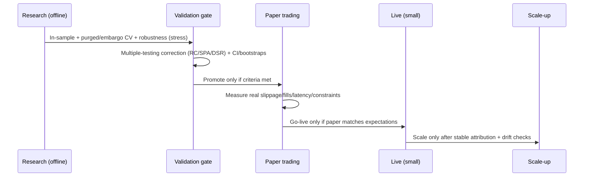

# Why Backtests Fail in Live Trading

## Executive summary

Backtests fail live for three blunt reasons: **you used information you didn’t truly have (leakage)**, **you selected a winner by chance (multiple testing / weak inference)**, or **you assumed a frictionless market (execution and microstructure mismatch)**. A fourth “quiet killer” is **data reality**: corporate actions, delistings, timestamp issues, data revisions, outages, and—in some markets—manipulated prints. These are not academic edge cases; they regularly move results by **tens to hundreds of basis points per year**, and for high‑turnover strategies, the “edge” often disappears entirely once realistic spreads, slippage, and partial fills are applied. citeturn20view2turn0search1turn0search4turn13search2turn5search0

A disciplined approach treats backtests as **a controlled experiment with audit trails**, not as a leaderboard. Industry-grade evidence control includes: **point‑in‑time data**, survivorship‑free universes, **embargoed/purged cross‑validation**, multiple-testing corrections (Reality Check / SPA / Deflated Sharpe), and execution simulation that uses **bid/ask quotes, realistic fill models, and market impact**. citeturn7search1turn3search9turn0search1turn0search4turn9search3turn2search0

Contrarian but usually correct: even if you remove every identifiable bias, many strategies still fail because **markets are adaptive and your backtest is a historical artifact**; “robust” in-sample performance is common even when true out-of-sample expectancy is near zero—especially after large-scale parameter searches. citeturn0search1turn0search2turn9search4turn11search6

What most practitioners should prioritize:
1) **Leakage control (point-in-time + lags + survivorship-free)**,  
2) **Multiple-testing control (PBO/Reality Check/SPA/Deflated Sharpe + strict OOS)**,  
3) **Execution realism (spreads, partial fills, market impact, latency)**,  
4) **Regime and robustness testing (walk-forward + stress tests + monitoring)**. citeturn7search2turn0search4turn9search3turn2search0turn12search0

## How backtests become biased

A backtest is a pipeline that maps **(data → features → decisions → simulated execution → P&L)**. Bias enters when any stage uses:
- **Information not available at the decision time** (explicitly or implicitly),
- **A selection process that rewards luck** (many trials, one winner),
- **A mismatched model of tradeability** (fills, costs, liquidity, constraints),
- **A dataset that is not the world you could have traded** (survivors, revised series, data errors, manipulated volume). citeturn7search2turn0search4turn2search0turn11search6turn20view2

Two points that are easy to miss:
- **Bias compounds**: small leaks + mild overfitting + 5–20 bps of unmodeled per-trade friction can turn a “great” Sharpe into a negative live expectancy. citeturn0search1turn5search0turn13search0  
- **Time series are not i.i.d.**: serial correlation and time aggregation can inflate risk-adjusted statistics if you annualize naïvely or ignore dependence. citeturn0search11turn9search2

Asset-class caveat (since your assumptions are unspecified): the *dominant* failure mode differs by venue. Equities are dominated by corporate actions, borrow/short constraints, and routing/venue effects; futures by roll, margin, and session boundaries; crypto by venue fragmentation, fee tiers, funding/liquidation mechanics, and (on some venues) questionable prints/volume. citeturn7search3turn14search3turn14search2turn11search6turn11search4

## Failure modes and biases

The matrix below covers the requested items and additional ones that routinely matter. “Impact” is an **order-of-magnitude** statement where reliable general numbers exist; otherwise it is expressed as a scaling rule (because the truth depends on volatility, turnover, liquidity, and constraints).

| Failure mode | Definition (mechanism) | Concrete example | Typical quantitative impact (when estimable) | Detection tests (practical) | Mitigation techniques (robust) |
|---|---|---|---|---|---|
| Look-ahead bias | Any use of data that was not observable at the decision timestamp (including bar-close leakage and “publication lag” neglect). citeturn1search11turn3search9turn7search2 | Signal uses same-bar close to decide and assumes fill at that close; or uses fundamentals with period-end dates instead of release dates. citeturn3search9turn7search2 | Can transform random strategies into apparently significant ones; effect is unbounded in principle (it is “seeing the future”). citeturn3search9turn1search11 | 1) Shift all features forward by 1 bar (if performance collapses, you leaked). 2) Audit “data availability time” per field. 3) Run “as-of” reconstruction checks. citeturn7search2turn3search9 | Point-in-time datasets; enforce conservative lags; event-time alignment (earnings release time, macro vintage); separate “signal time” vs “fill time” explicitly. citeturn7search1turn7search2turn3search9 |
| Survivorship bias | Universe excludes delisted/failed assets or funds, truncating losers and overstating performance. citeturn1search2turn20view2turn15view1 | Backtest uses today’s index constituents or only currently listed tickers; dead funds are missing. citeturn1search11turn1search2 | Empirically often **tens to ~200 bps/year** depending on setting; e.g., survivorship bias estimates reported in mutual fund studies range roughly from **~0.3% to ~1.9% annualized** depending on metric and assumptions. citeturn20view2turn15view1 | 1) Re-run with a survivor-bias-free dataset. 2) Check delist/merge counts vs expected. 3) Measure return shift after adding delisting returns. citeturn7search3turn1search2turn20view2 | Use survivorship-free data (e.g., datasets tracking both live and delisted members); include delisting returns; store membership as-of dates. citeturn1search2turn7search3 |
| Data snooping / multiple testing | Reusing the same data for model selection/inference inflates false discoveries; the “best” model among many is expected to be overfit. citeturn0search4turn9search4turn0search1 | Tried 100k parameter sets; picked top Sharpe; reported “significant” result without correction. citeturn0search4turn0search1 | False positives become likely even when no true alpha exists; multiple-testing frameworks show significance thresholds must rise when many factors/strategies are tried. citeturn9search4turn0search4turn0search1 | 1) Reality Check / Stepwise tests. 2) SPA test. 3) Track and report total “research degrees of freedom” (how many trials). citeturn0search4turn9search3turn3search2 | Pre-register research protocol; hold-out that is never touched; apply multiple-testing corrections (Reality Check / SPA / Deflated Sharpe); keep a “trial counter” as a first-class metric. citeturn0search4turn9search3turn0search1turn9search4 |
| Overfitting (model complexity) | Model fits noise because degrees of freedom exceed effective sample size; time-series dependence worsens this. citeturn0search2turn0search11 | High-dimensional ML with many features on limited history; heavy feature engineering tuned to in-sample. citeturn3search9turn0search2 | Out-of-sample decay is expected; methods quantify “probability of backtest overfitting.” citeturn0search2turn0search1 | 1) Combinatorially symmetric cross-validation and PBO-style checks. 2) Stability under small perturbations (noise injection). citeturn0search2turn3search9 | Reduce model class; regularization; purged/embargo CV for finance; nested CV (tuning inside training folds only). citeturn3search9turn0search2 |
| Curve fitting (parameter tuning) | Choosing precise thresholds/periods that exploit quirks of the backtest window rather than stable structure. citeturn0search1turn0search2 | “RSI length 17, stop 1.43%, TP 3.07%” outperforms; nearby values do not. | Often shows up as high sensitivity: tiny parameter changes collapse returns; “knife-edge” strategies rarely survive. citeturn0search2turn0search1 | 1) Parameter surface smoothness checks. 2) Walk-forward parameter stability. 3) Random sub-sample stability. citeturn0search2turn12search0 | Prefer broad plateaus over peaks; simplify rules; use walk-forward with constrained parameter drift; report sensitivity, not only the optimum. citeturn12search0turn0search2 |
| Unrealistic execution (fills) | Backtest fill model assumes fills that could not occur (e.g., always full fill at mid/last, zero queue). citeturn5search4turn5search0turn10search0 | Limit orders assumed filled whenever bar touches price; ignores queue priority and partial fills. citeturn5search4turn10search0 | For tight targets/stops, fill assumptions can flip sign of expectancy; partial fills are common in reality but many backtest engines assume complete fills. citeturn5search4turn10search0 | 1) Compare simulated fills vs historical quote dynamics. 2) Replay-style micro checks on a sample. 3) Stress by degrading fill probability. citeturn5search4turn11search3 | Use quote data where possible; implement realistic fill models (partial fills, queue); require “tradeable confirmation” (e.g., limit fill probability models). citeturn5search4turn5search12turn2search8 |
| Market impact | Your trading moves price (temporary/permanent impact), so execution cost grows with size and liquidity conditions. citeturn2search0turn2search2turn2search21 | Strategy looks great at $10k notional; fails at $10M because fills push price and increase slippage. citeturn2search0 | Empirical work supports concave impact (often approximated by square-root in size vs volume), making scaling non-linear. citeturn2search21turn2search2 | 1) Capacity analysis: model costs vs participation rate. 2) Re-run backtest with impact model. 3) Check performance vs volume regimes. citeturn2search0turn2search11 | Add market impact model; cap participation; optimal execution scheduling (cost–risk tradeoff); report “capacity at target Sharpe.” citeturn2search0turn2search11 |
| Incorrect transaction costs | Missing or understated commissions, maker/taker fees, spreads, exchange fees, funding/financing, borrow costs, taxes. citeturn13search0turn6search1turn6search3turn14search3 | Backtest excludes fees; live pays maker/taker and spread; or ignores borrow locate/fees for shorts. citeturn6search1turn14search3 | High turnover means small per-trade costs dominate; implementation shortfall is a standard way to measure the “paper vs real” gap. citeturn13search0turn2search11 | 1) Add conservative cost haircuts and check if edge survives. 2) Compare simulated vs realized slippage distributions. citeturn5search0turn13search0 | Use explicit fee schedules; model spreads using bid/ask; include financing/funding/borrow; exceed “break-even cost” tests by a margin, not a hair. citeturn6search1turn6search3turn13search2turn14search3 |
| Timeframe / intrabar aggregation errors | With OHLC bars you do not know the within-bar path; stop/limit/TP ordering can be undecidable and engines must assume a path. citeturn10search12turn10search0turn10search1 | Bar’s high and low both cross stop and target; backtest chooses favorable ordering; live may do the opposite. citeturn10search12turn10search1 | Can flip win/loss outcomes for tight stops/targets and high-frequency logic; correctness depends on assumptions and engine implementation. citeturn10search0turn10search12 | 1) Identify “ambiguous bars” where both events occur. 2) Run “best-case vs worst-case” fill ordering. 3) Validate engine correctness tests for candle backtesting. citeturn10search0turn10search12turn10search1 | Use higher-resolution data (ticks/quotes) when logic is intrabar; define consistent intrabar rules; avoid strategies whose edge depends on ambiguity. citeturn10search5turn10search12 |
| Data quality problems | Missing data, bad prints, wrong timestamps, corporate action errors, stale quotes, exchange outages, and vendor-specific quirks. citeturn11search3turn7search3turn5search7 | Spurious wicks trigger stops; duplicated trades; timestamp drift causes misordered events; delisting returns missing. citeturn11search3turn7search3 | Can create phantom alpha or hide drawdowns; HF research explicitly requires cleaning filters for TAQ-type data. citeturn11search3turn11search11 | 1) Data diagnostics: nulls, duplicates, outliers, timestamp monotonicity. 2) Cross-source reconciliation (two vendors). 3) “Bad print” sensitivity backtests. citeturn11search3turn11search11 | Formal data cleaning pipeline; corporate-action reconciliation; multi-source sanity checks; store raw + cleaned with provenance. citeturn11search3turn7search3 |
| Regime bias / nonstationarity | Strategy is trained/selected in a regime that won’t persist; distributions shift (volatility, correlation, liquidity). citeturn12search0turn12search4turn10search3 | Trend strategy chosen after a decade of trending markets; mean reversion chosen after choppy markets. citeturn12search4 | Regime switching is empirically plausible; correlations and vol differ across regimes. citeturn12search1turn12search4 | 1) Walk-forward by regime slices. 2) Stress tests in high-vol/low-vol. 3) Hidden Markov / regime diagnostics (as analysis, not as a crutch). citeturn12search0turn12search4 | Use longer and more diverse histories; diversify across signals; constrain leverage dynamically; require performance in multiple disjoint regimes and markets. citeturn12search1turn12search2 |
| Small sample size / noisy Sharpe | Too few independent observations; Sharpe estimation is noisy and distorted by autocorrelation and fat tails. citeturn0search11turn9search2 | “Sharpe 2.0” based on 1 year of daily returns or 30 trades. citeturn0search11 | Sharpe ratio inference requires correct distributional assumptions; time series nature and heavy tails break classic tests. citeturn0search11turn9search2 | 1) Confidence intervals / bootstrap for Sharpe. 2) Minimum track record length checks. 3) Block bootstrap for dependence. citeturn0search11turn9search2turn0search2 | Use robust Sharpe inference; increase sample length; reduce turnover reliance; aggregate across assets to increase effective N (carefully). citeturn9search2turn0search11 |
| Selection bias / reporting bias | After many attempts, only winners are shown; losers are discarded. citeturn9search4turn3search2 | You explored 500 ideas but only keep the best 3; you forget the 497 failures. citeturn3search2 | Strongly inflates perceived hit rate; the “factor zoo” literature formalizes how massive discovery inflates false positives. citeturn9search4 | 1) Maintain experiment log with all trials. 2) Evaluate expected false discovery rate given N trials. citeturn9search4turn0search1 | Governance: strict research logs, pre-defined acceptance criteria, and correction for multiple comparisons. citeturn0search1turn0search4turn9search4 |
| Incorrect position sizing / leverage model | Backtest assumes leverage/margin/financing that cannot be maintained; ignores tail risk and path dependency. citeturn14search2turn14search6turn14search0 | Uses Kelly sizing from in-sample stats; ignores drawdown risk; margins change in volatile periods. citeturn14search0turn14search2turn14news40 | Margin requirements and risk-of-ruin effects make realized growth highly path-dependent. citeturn14search0turn14search10 | 1) Stress with higher margin / haircuts. 2) Simulate liquidation triggers. 3) Path-wise Monte Carlo (trade order reshuffle). citeturn14search2turn0search2 | Model margin and financing explicitly; use conservative fractional Kelly or risk-based sizing; enforce leverage caps and drawdown stops. citeturn14search0turn14search2turn14search6 |
| Indicator repainting | Historical plots/signals differ from real-time behavior; scripts may revise past signals as new bars arrive. citeturn4search0turn4search8 | Higher-timeframe data requested in a script produces non-reproducible past signals unless handled with correct lookahead settings; signals “move” on refresh. citeturn4search8turn4search12 | Produces “perfect” historical timing that is impossible live; effect can be total (100% fake precision). citeturn4search0turn4search3 | 1) Recompute on replay / bar-by-bar confirmed logic. 2) Compare historical vs real-time states. 3) Refresh/reload invariance tests. citeturn4search8turn4search0 | Use confirmed bars only; avoid repainting constructs; enforce explicit non-repainting coding patterns for multi-timeframe data. citeturn4search12turn4search0 |
| Latency and asynchronous reality | Strategy assumes instant reaction; live has network latency, exchange processing delays, and asynchronous ordering of events. citeturn10search3turn5search7 | Signal→order takes 200ms; the edge is in first 20ms; or API timeouts create uncertain execution state. citeturn10search3turn5search7 | In latency-sensitive contexts, small delays can erase the edge; continuous markets create latency arbitrage incentives. citeturn10search3turn10search15 | 1) Latency injection in sim (delay the signal). 2) Compare fill-to-signal timestamps. 3) Race-condition and duplicate-order tests. citeturn5search7turn13search11 | Engineer for deterministic state; use event-driven OMS; co-locate or abandon latency-sensitive strategies; use exchange-grade protocols when needed. citeturn5search7turn10search3 |
| Psychological bias / researcher degrees of freedom | Human choices (filters, date ranges, parameter grids) are influenced by results; effectively p-hacking. citeturn3search2turn3search3 | You keep tweaking until equity curve looks smooth; you stop when it “works.” citeturn3search2 | Can raise false positive rate dramatically under flexible analysis. citeturn3search2turn3search3 | 1) Blind analysis (hide performance until final). 2) Predefine decision rules. 3) Independent replication by another researcher. citeturn3search2turn3search3 | Governance: pre-registration style discipline, immutable logs, and separation between research and evaluation roles. citeturn3search2turn9search4 |
| Incorrect benchmarking | Comparing to the wrong baseline, ignoring investability, or ignoring risk exposures (beta disguised as alpha). citeturn8search0turn8search1turn1search11 | Strategy “beats cash” but underperforms a simple market portfolio; or seems “alpha” but is just SMB/HML momentum exposure. citeturn8search0turn8search1 | A large share of return variation can be explained by common factors; “alpha” vanishes after factor regression in many cases. citeturn8search0turn8search1 | 1) Factor regression attribution. 2) Compare to investable benchmark net of costs. 3) Test for option-like payoffs / hidden convexity. citeturn8search0turn8search1turn0search11 | Use appropriate benchmark(s) per asset class; report beta and factor exposures; compare net-of-costs to realistic alternatives. citeturn8search0turn8search1turn1search11 |
| Hidden correlation / crowdedness | Apparent diversification is fake; strategies share underlying risk (liquidity, vol, crash exposure). citeturn12search1turn8search0 | “Multi-strategy” portfolio all long equity beta and short volatility in disguise. citeturn8search0turn12search1 | Correlations can rise sharply in stress regimes; diversification benefits collapse. citeturn12search1turn12search8 | 1) Stress correlation analysis by regime. 2) Tail dependence tests. 3) Crisis-period replay. citeturn12search1turn12search8 | Diversify by true drivers (time horizon, instruments, execution style); risk-factor budgeting; scenario-based risk limits. citeturn8search0turn12search4 |
| Data revisions / restatements | Using “latest available” macro/fundamental data instead of the vintage that existed at the time; restated statements leak the future. citeturn7search2turn7search14turn7search12 | Backtest uses revised GDP or restated financials; real-time trader would have seen earlier vintages. citeturn7search2turn7search14 | Can flip sign of predictive relationships in macro/nowcasting contexts; “vintage matters.” citeturn7search2turn7search14 | 1) Vintage replay backtests. 2) Compare performance with final vs real-time vintages. citeturn7search2turn7search14 | Store and use vintages (real-time datasets); point-in-time vendor products; enforce publication lags. citeturn7search2turn7search1 |
| Borrow/shorting constraints | Strategy assumes shorts are always available and cheap; ignores locate rules and borrow fees. citeturn14search3turn14search19 | Backtest shorts microcaps freely; live cannot locate shares or borrow cost spikes. citeturn14search3 | Can entirely remove implementability; costs can dominate expected return for hard-to-borrow names. citeturn14search3 | 1) Simulate borrow availability filters. 2) Apply hard-to-borrow fee haircuts. 3) Check short interest / fails-to-deliver proxy data where relevant. citeturn14search3turn14search7 | Restrict universe to borrowable assets; include borrow fees; build fallback execution logic when locate fails. citeturn14search3turn14search19 |
| Venue integrity / manipulated prints (market-specific) | Reported trades/volume may include non-economic activity (wash trading) or spoof-like artifacts; leads to false liquidity assumptions. citeturn11search6turn11search4turn11search12 | Strategy relies on reported volume/liquidity that is inflated; execution fails or costs explode live. citeturn11search6turn11search4 | Evidence of non-economic volume exists in some crypto settings; regulators and academic work document detection methods and inflation claims. citeturn11search4turn11search6turn11search12 | 1) Cross-venue volume realism checks. 2) Benford/rounding and behavioral pattern tests (venue-dependent). citeturn11search6turn11search4 | Use vetted venues/data vendors; emphasize quote-based liquidity metrics; avoid strategies requiring fragile liquidity assumptions on weak venues. citeturn11search6turn11search2 |

## Tables on common data sources and backtesting pitfalls

### Comparative table of common data sources and venues

Notes up front: “Quality” is about **fitness for backtesting** (point-in-time, survivorship-free, corporate actions, completeness). “Latency” here is **what the provider/venue documents or structurally implies** (protocols, timeouts, rate limits), not a promise of your achievable round-trip time. citeturn5search7turn11search3turn7search3

| Source / venue | Category | Backtest-relevant strengths | Known issues / caveats (backtesting) | Latency / access characteristics | Fees / cost surface (high-level) |
|---|---|---|---|---|---|
| entity["organization","CRSP","wrds security prices us"] | Historical market data (academia/industry) | Designed to reduce survivorship bias; includes delisting returns flags and related data in stock/index guides. citeturn1search2turn7search3turn7search7 | Requires correct handling of delisting returns and corporate actions; misuse can silently bias results. citeturn7search3turn7search7 | Bulk datasets; not designed for ultra-low-latency execution. | Licensed dataset (institutional pricing/license constraints). citeturn7search3 |
| entity["organization","LSEG","lseg data analytics"] (Quantitative Analytics) | Data vendor | Publishes *original point-in-time* and restated values and includes delisted company data to reduce look-ahead and survivorship bias risks. citeturn7search1 | Still requires the user to enforce explicit “availability timestamps” and lags in the modeling layer. citeturn7search1turn7search2 | Cloud provision; latency depends on API/product architecture rather than matching-engine proximity. | Subscription; varies by product and delivery. citeturn7search1 |
| entity["organization","S&P Dow Jones Indices","index provider us"] | Index provider / benchmark data | Methodology docs and index materials warn that backtested performance can embody survivor/look-ahead effects and is not the result of actual trading. citeturn1search11turn1search3 | Index backtests may use hindsight in constituent selection/methodology application; can be “non-investable” in execution terms. citeturn1search11turn1search3 | Published index levels; not an execution venue. | Licensing for commercial use; investor-facing is indirect (fund fees). citeturn1search3 |
| entity["company","CME Group","derivatives exchange us"] | Futures/options venue + fee schedules | Transparent fee schedule documents and margin concepts; margin requirements vary by product and volatility. citeturn6search3turn6search7turn14search2turn14news40 | Backtests often omit margin dynamics and session boundaries; margin changes can alter feasible leverage during stress. citeturn14search2turn14news40 | Exchange-grade infrastructure; latency depends on connectivity and co-location, but margins/clearing add operational constraints. | Exchange/clearing fees vary by membership, product, and venue; published schedules exist. citeturn6search3turn6search7 |
| entity["company","Binance","crypto exchange"] | Crypto venue + APIs | Published fee tiers; provides FIX connectivity docs; documents request timeout behavior. citeturn6search8turn5search7 | Crypto venue fragmentation; operational/API edge cases like “status unknown” on timeout must be engineered around to avoid duplicate/ghost orders. citeturn5search7 | FIX + other APIs; FIX docs note backend timeout behavior. citeturn5search7 | Maker/taker fees vary by tier; fee pages published. citeturn6search8turn6search0 |
| entity["company","Coinbase","crypto exchange us"] | Crypto venue + apps | Explains maker/taker mechanics and partial maker/taker treatment for partially matched orders. citeturn6search1turn6search5 | Fee tiers change with volume; strategy cost must model a tier rule consistent with expected live volume. citeturn6search1turn6search5 | API access; latency depends on API style (REST/WebSocket) and routing. | Maker/taker schedule published; partial matches charged accordingly. citeturn6search1turn6search5 |
| entity["company","Kraken","crypto exchange"] | Crypto venue + fee schedules | Provides fee schedule and detailed maker/taker explanations and examples. citeturn6search10turn6search6 | Same structural issues as other fragmented venues; backtesting must model fees and liquidity realistically. citeturn6search10turn5search4 | API access; latency depends on method and infrastructure. | Fee examples and schedules published. citeturn6search10turn6search6 |
| entity["company","Interactive Brokers","brokerage us"] | Broker / execution + data access | Provides API access for market data and order routing; execution quality and reporting regimes exist in equities contexts. citeturn5search6turn5search10turn13search3 | Broker routing, market data permissions, and reporting rules affect realized prices; backtests ignoring routing/execution quality can misestimate fills. citeturn13search3turn13search11 | Event-driven APIs (incl. websocket-style) are available; operational latency includes broker stack. citeturn5search10turn5search6 | Commissions and data subscriptions vary by product/account; must be modeled explicitly. citeturn5search2turn5search6 |

### Table of common pitfalls by severity, detectability, and mitigation difficulty

These ratings are practitioner heuristics meant to prioritize work; they reflect typical damage to live performance and how often teams miss the issue.

| Pitfall | Severity if present | Detectability | Mitigation difficulty | Why it ranks this way (one-line) |
|---|---|---|---|---|
| Look-ahead / leakage | Very high | Medium | Medium | Can fabricate alpha; requires disciplined time-stamping and as-of data handling. citeturn7search2turn3search9 |
| Multiple testing / snooping | Very high | Medium | Medium–High | “Winner’s curse” is near-guaranteed at scale; needs formal corrections and governance. citeturn0search4turn9search3turn0search1 |
| Execution realism (fills, spreads, partial fills) | Very high | Medium | High | Many engines assume complete fills; realistic modeling is hard without quotes/LOB. citeturn5search4turn10search0turn5search12 |
| Market impact / capacity | High | Low–Medium | High | Scaling can destroy returns; credible impact modeling requires market microstructure + sizing discipline. citeturn2search0turn2search21 |
| Survivorship bias | High | Medium | Medium | Common when using “current constituents”; solvable with correct datasets and delisting returns. citeturn1search2turn7search3turn20view2 |
| Intrabar ambiguity (OHLC) | High (for tight stops) | Medium | Medium–High | If your edge depends on within-bar ordering, OHLC backtests can be structurally wrong. citeturn10search12turn10search1 |
| Data errors / bad prints | Medium–High | Medium | Medium | Dirty data creates phantom signals; cleaning and reconciliation are necessary plumbing. citeturn11search3turn7search3 |
| Nonstationarity / regime bias | Medium–High | Low | High | Even unbiased backtests can fail if regime shifts; mitigation is diversification + adaptive risk. citeturn12search4turn12search1 |
| Noisy Sharpe / small N | Medium | High | Medium | Easy to diagnose statistically; hard to fix without more data or a different strategy class. citeturn0search11turn9search2 |
| Repainting indicators | Medium–High | Medium–High | Low–Medium | Often a coding/config issue; platform docs describe what causes it. citeturn4search0turn4search8 |
| Benchmarking / factor exposure blind spots | Medium | Medium | Medium | “Alpha” can be beta; factor attribution is standard but often skipped. citeturn8search0turn8search1 |
| Borrow/margin constraints | Medium–High | Medium | Medium–High | Shorts and leverage are conditional; real constraints bite hardest in stress. citeturn14search3turn14news40turn14search2 |

## Detection and validation toolkit

A rigorous workflow uses **stacked validation**, because no single test catches all failure modes.

**Multiple-testing and performance inference (must-have when you search broadly):**
- **Reality Check** methods address data snooping explicitly by testing whether the best model’s outperformance could be due to chance. citeturn0search4  
- **SPA test** improves power and reduces sensitivity to poor alternatives compared to Reality Check in some settings. citeturn9search3turn9search7  
- **Deflated Sharpe Ratio** corrects for selection bias, non-normality, and multiple testing in Sharpe-based selection. citeturn0search1  
- **Robust Sharpe inference** (e.g., bootstrap / time-series methods) matters because financial returns are dependent and heavy-tailed. citeturn9search2turn0search11  
- **Raise the hurdle** when you are “mining” many signals; factor-literature work formalizes why naive t>2 thresholds are not credible in large search spaces. citeturn9search4turn9search0

**Cross-validation for time series (must-have for ML / feature-heavy strategies):**
- Standard k-fold CV leaks information when labels overlap in time; finance-specific methods use **purging and embargo** concepts to reduce leakage. citeturn3search9turn3search1

**Data integrity and microstructure sanity checks:**
- When using high-frequency trade/quote data, published approaches emphasize cleaning filters and handling data challenges explicitly. citeturn11search3turn11search11  
- A practical check: re-run strategy on **two independent data sources**; if the edge disappears, you may be “trading the vendor.” citeturn11search3turn7search3

**Execution realism tests:**
- Use a backtest engine that makes fill modeling explicit (slippage, partial fills, quote-based fills); many frameworks warn that default fill assumptions are simplified. citeturn5search0turn5search4turn5search12  
- For bar-based systems, identify “ambiguous” candles and compute best vs worst ordering; academic work highlights that candle-only backtesting can be undecidable for certain order combinations. citeturn10search12turn10search0

## Recommended backtesting pipeline architecture

Below is a reference architecture that is **deliberately biased toward not fooling yourself**. It is heavier than what most retail systems do, but each component corresponds to a documented failure mode above.

```mermaid
flowchart TD
  A[Raw data ingestion<br/>trades, quotes, corp actions, fundamentals, macro vintages] --> B[Normalization<br/>timezones, sessions, symbology, corporate actions]
  B --> C[Quality layer<br/>cleaning, outlier filters, gap detection, cross-source checks]
  C --> D[Point-in-time store<br/>as-of snapshots, publication timestamps, membership history]
  D --> E[Feature & label generation<br/>explicit availability times, leakage tests]
  E --> F[Backtest engine<br/>event-driven, same codepath as live]
  F --> G[Execution simulation<br/>bid/ask, partial fills, fees, impact, latency injection]
  G --> H[Validation suite<br/>walk-forward, purged CV, RC/SPA, DSR, bootstrap, stress tests]
  H --> I[Paper trading<br/>real venue constraints, telemetry, reconciliation]
  I --> J[Live trading (small)<br/>kill-switches, drift monitors]
  J --> K[Monitoring & attribution<br/>slippage, fill rates, factor exposures, regime shifts]
```

Key design principles (each is a mitigation tied to sources):
- **Point-in-time and vintage correctness**: store as-of data, publication timestamps, and membership history to prevent revisions and survivorship artifacts. citeturn7search2turn1search2turn7search1turn7search3  
- **Engine correctness and bar ambiguity awareness**: candle-only engines must make intrabar assumptions; correctness is subtle and testable. citeturn10search0turn10search12  
- **Execution realism as first-class**: model slippage, partial fills, and fill price rules explicitly rather than implicitly assuming mid/last. citeturn5search0turn5search4turn5search12  
- **Statistical governance**: track experiment counts and apply multiple-testing corrections; otherwise your “best backtest” is typically the luckiest. citeturn0search4turn9search3turn0search1turn9search4  
- **Live/paper integration and telemetry**: your paper system should produce the same order events and fill accounting you’ll rely on live; venues can have edge-case behaviors such as timeouts leading to “execution status unknown.” citeturn5search7turn13search11

A practical validation timeline (how to stop “research drift”):



## Prioritized practitioner checklist

This is a pragmatic checklist ordered by how often each item prevents expensive self-deception.

1) **Make “data availability time” explicit for every feature** (and enforce conservative lags by default). If you cannot timestamp it, treat it as unavailable. citeturn7search2turn7search1  
2) **Use survivorship-free universes and delisting returns** (or equivalent for your asset class). citeturn1search2turn7search3turn20view2  
3) **Count your trials** (parameter sets, models, features) and apply at least one multiple-testing defense (Reality Check / SPA / Deflated Sharpe). If you don’t, your backtest winner is probably luck. citeturn0search4turn9search3turn0search1  
4) **Demand stability**: performance should survive modest perturbations—parameter nudges, cost haircuts, different subperiods, different instruments/regions. citeturn0search2turn12search1  
5) **Model execution on bid/ask and allow partial fills**; if you only have OHLC bars and tight stops/targets, explicitly run worst-case intrabar ordering. citeturn5search4turn10search12turn10search1  
6) **Include the full cost stack**: fees, spreads, financing/funding, borrow constraints, and margin/leverage rules. citeturn13search0turn6search1turn14search2turn14search3  
7) **Do a capacity analysis**: report expected performance versus trade size/participation and include a market impact model. citeturn2search0turn2search21  
8) **Perform factor attribution and benchmark honestly**: show beta/factor exposures alongside “alpha,” and compare to investable alternatives net of costs. citeturn8search0turn8search1turn1search11  
9) **Paper trade with telemetry** (slippage distribution, fill rates, latency, rejects/timeouts) before scaling; treat venue/API edge cases as part of the strategy. citeturn5search7turn13search11  
10) **Monitor drift and regime**: if live slippage, fills, or factor exposures drift, assume your backtest assumptions are breaking and reduce risk until explained. citeturn12search4turn2search11